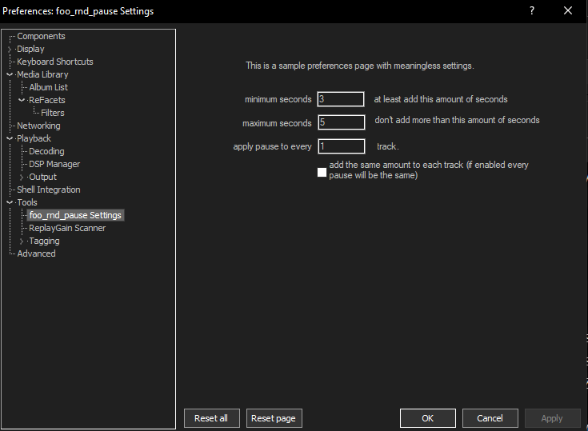

# foo_rnd_pause

A simple foobar2000 plugin that inserts random pauses between tracks.

## Installation

1. Download the latest DLL from [Release v1.0.0](https://github.com/ak-zen-craft/foo_rnd_pause/releases/tag/v1.0.0).
2. Copy the DLL into your foobar2000 `components` folder.  
   For guidance on installing foobar2000 components, see the [HydrogenAudio Wiki](https://wiki.hydrogenaudio.org/index.php?title=Foobar2000:How_to_install_a_component).
3. Restart foobar2000 and enable the plugin in Preferences.

## Features

- Adds random pauses between tracks.

## Screenshot

## Usage

- Once installed and enabled, the plugin automatically handles track pauses.
- You can adjust settings via the plugin’s preferences dialog.

## License

This project is licensed under the MIT License. See the [LICENSE](LICENSE) file for details.

## Contributing

Feel free to open issues or submit pull requests.  
Ensure your contributions follow the coding style and include clear comments.

## Changelog

- **v1.0.0** – Initial release
